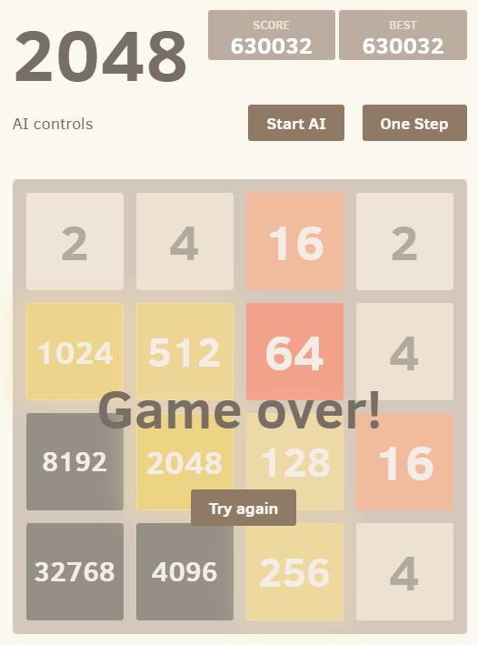

<div align="center">
	<h1><a>2048 AI Solver - Expectimax Algorithm in WebAssembly</a></h1>
</div>

------------------------------------------------------------------------------------------------------------------------------------------

#### An advanced Artificial Intelligence (AI) bot designed to master and solve the popular 2048 game. This highly optimized AI can consistently reach the 16384 tile, and frequently achieves the elusive 32768 tile!

The AI achieved the 32768 tile in the browser version after just 5 attempts with a staggering high score of 630032. 



------------------------------------------------------------------------------------------------------------------------------------------

### Play Now
Experience the AI in action directly in your browser: **[Play 2048 AI Online](https://ishandutta2007.github.io/2048-ai)**

------------------------------------------------------------------------------------------------------------------------------------------

### How It Works: The Algorithm

This 2048 AI utilizes an **Expectimax search algorithm** running entirely in parallel within your browser. There is no back-end server or browser control required, making it incredibly fast and efficient even on mobile devices.

The architecture leverages:
- **4 Web Workers:** Each worker is a WebAssembly (Wasm) module compiled from C++ using Emscripten.
- **Parallel Processing:** Expectimax search is performed for each available move simultaneously.
- **Deep Search:** Utilizing heavy optimizations like bitboard representation and lookup tables, the AI can search very deep (default search depth is 7) in milliseconds.

------------------------------------------------------------------------------------------------------------------------------------------

### Key Features & Optimizations

- **64-bit Bitboard Representation:** For lightning-fast board state manipulation.
- **Table Lookup:** Pre-calculated tables for movement and evaluation.
- **Iterative Deepening:** Dynamic depth search based on the current board position.
- **Top-Level Parallelism:** True multi-threading in the web browser.
- **Node Pruning:** Efficiently prunes nodes with low probability to save compute cycles.
- **Dynamic Probability Threshold:** Adapts during runtime for optimal performance.
- **Zobrist Hash & Transposition Table:** 80MB table for console, scaling up to 320MB in the web version to cache previously evaluated board states.

------------------------------------------------------------------------------------------------------------------------------------------

### Benchmarks & Performance

** (Tested on Console application, Intel® Core™ i5-8300H Processor) **

| Search Depth | Games Played | Avg Score | % 32768 | % 16384 | % 8192 | % 4096 | Time/Game | Moves/sec |
|--------------|--------------|-----------|---------|---------|--------|--------|-----------|-----------|
| **3 ply**    | 1000         | 216,159   | 0.8%    | 43.0%   | 85.4%  | 98.1%  | 3s        | 2343      |
| **5 ply**    | 300          | 283,720   | 2.0%    | 66.3%   | 96.0%  | 100%   | 17s       | 648       |
| **7 ply**    | 100          | 353,368   | 12.0%   | 85.0%   | 98.0%  | 100%   | 87s       | 158       |

------------------------------------------------------------------------------------------------------------------------------------------

### Heuristics and Evaluation

A strong evaluation function is critical. This AI uses sophisticated heuristics to not only increase strength but also guide the search into positions that are faster to evaluate:
- **Smoothness:** Encourages boards that are easier to merge.
- **Monotonicity:** Keeps larger tiles in corners and edges.
- **Empty Tiles:** Rewards keeping the board open to prevent getting stuck.

** Note: Heuristic weights are inspired by the excellent work from [nneonneo's 2048-ai](https://github.com/nneonneo/2048-ai). **

------------------------------------------------------------------------------------------------------------------------------------------

### Installation & Usage

We recommend using a Linux environment for the best development experience. 
** Windows users: Open Developer Command Prompt for Visual Studio and use `nmake` instead of `make`. **

------------------------------------------------------------------------------------------------------------------------------------------

### Web Version (Recommended)

To run the web version locally or edit search parameters/heuristics, you need [Emscripten](https://emscripten.org/docs/getting_started/downloads.html).

1. Compile the web version:
   ```sh
   make web
   ```
2. Serve the directory using Node.js `serve`:
   ```sh
   npx serve
   ```
3. Access the AI via `http://localhost:3000`.

------------------------------------------------------------------------------------------------------------------------------------------

### Console Application (For Benchmarking)

The console app has no UI and is built specifically for raw performance testing.

1. Build the application:
   ```sh
   make
   ```
2. Run with parameters:
   - `-d [Depth]`: Search depth (1 to 4). Default is 1. (Note: Each depth is 2 ply + initial call. 1 = 3 ply, 3 = 7 ply).
   - `-i [Iterations]`: Number of games to play. Default is 1.
   - `-p`: Show detailed progress (Reduces performance).

#### **Examples:**
```sh
./2048 -d 3 -p  # Play 1 game with a search depth of 3 (7 ply) with detailed progress
./2048 -i 100   # Play 100 games with a search depth of 1 (3 ply)
```
Results are saved to `result.csv` for easy analysis in Excel or Google Sheets.

------------------------------------------------------------------------------------------------------------------------------------------

These resources are perfect for both beginners and advanced learners.
